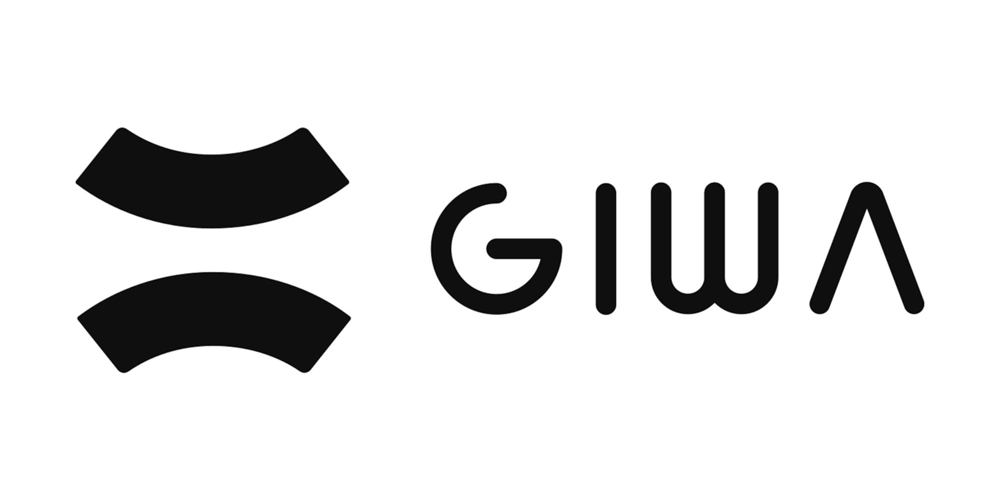

# Giwa Node


**Giwa** is a Ethereum Layer 2 network built on Optimism's [OP Stack](https://stack.optimism.io/).  
This repository provides everything you need to run your own node on the Giwa network.

## 💡 Supported Networks

| Network           | Status |
|-------------------|--------|
| Mainnet           | 🚧     |
| Testnet (Sepolia) | ✅      |


## 🚀 Quick Start

1. Ensure you have an Ethereum L1 full node RPC available
2. Choose your network
    - For **mainnet**: *Coming soon – mainnet is currently under development.*
    - For **Testnet (Sepolia)**: Use `.env.sepolia`
3. Configure your L1 endpoints in the env file. You can also customize other runtime parameters (e.g. network, cache, logging, metrics) directly in the env file.
   ```bash
   OP_NODE_L1_ETH_RPC=<your-preferred-l1-eth-rpc>
   OP_NODE_L1_BEACON=<your-preferred-l1-beacon>
   ```
4. Build and run
   ```bash
   docker compose build --parallel
   NETWORK_ENV=<.env.{network}> docker compose up -d
   ```

5. Stop
    ```bash
    docker compose down
    ```

6. Cleanup
    ```bash
    docker compose down -v && rm -rf ./execution_data
    ```


## 🛠️ Configuration

### Required Configuration

| Variable             | Description                        |
|----------------------|------------------------------------|
| `OP_NODE_L1_ETH_RPC` | Your Ethereum L1 node RPC endpoint |
| `OP_NODE_L1_BEACON`  | Your L1 beacon node endpoint       |


### Sync Configuration

Choose one of the following sync strategies depending on your preference.
> Enable the corresponding **OPTION** block in your `.env` (only one at a time).

#### 1) Snap Sync — Fast & Practical
- **What it does:** Downloads a recent state snapshot and syncs to the current head without executing every historical block.
- **Use when:** You want to bring up a production/full node quickly (RPC nodes, followers).
- **Trade‑offs:** Fastest to get online; not suitable for deep historical state queries.

#### 2) Archive Sync — Full History
- **What it does:** Executes every block from genesis and **retains all historical state** (archive).
- **Use when:** You run an indexer, do research/debugging, or need historical state at arbitrary blocks.
- **Trade‑offs:** Significantly slower and requires much more disk; most operators don’t need this for day‑to‑day operations.

#### 3) Consensus‑Driven Sync — Trust‑Minimized
- **What it does:** The consensus client **drives** the execution client by inserting unsafe blocks; no L2 peer discovery required for the execution client.
- **Use when:** You prefer replay‑based syncing and tighter control (e.g. L2 verifier).
- **Trade‑offs:** Slower than snap; operationally simpler for controlled environments.


## 💽 Persisting Data

By default, execution data is mounted to `{PROJECT_ROOT}/execution_data`.  
To customize the mount path, set the `$EXECUTION_DATA_DIR` environment variable.


## ⚙️ Hardware Requirements

### Testnet

| Resource | Minimum       | Recommended |
|----------|---------------|-------------|
| CPU      | 4 cores       | 8+ cores    |
| RAM      | 8 GB          | 16+ GB      |
| Disk     | 500 GB (NVMe) | 1+ TB       |


## 🙋 Troubleshooting

- To check logs:
```bash
docker compose logs -f giwa-el
docker compose logs -f giwa-cl
```


## 🛑 Disclaimer

THE SOFTWARE IS PROVIDED "AS IS", WITHOUT WARRANTY OF ANY KIND.  
By running this node, you are responsible for your infrastructure, security, and compliance.


## 🌐 Join the Giwa Community

- [📖 Documentation](https://docs.giwa.io)
- [🐦 X](https://x.com/giwachain)
- 💬 Discord: *Coming Soon*
